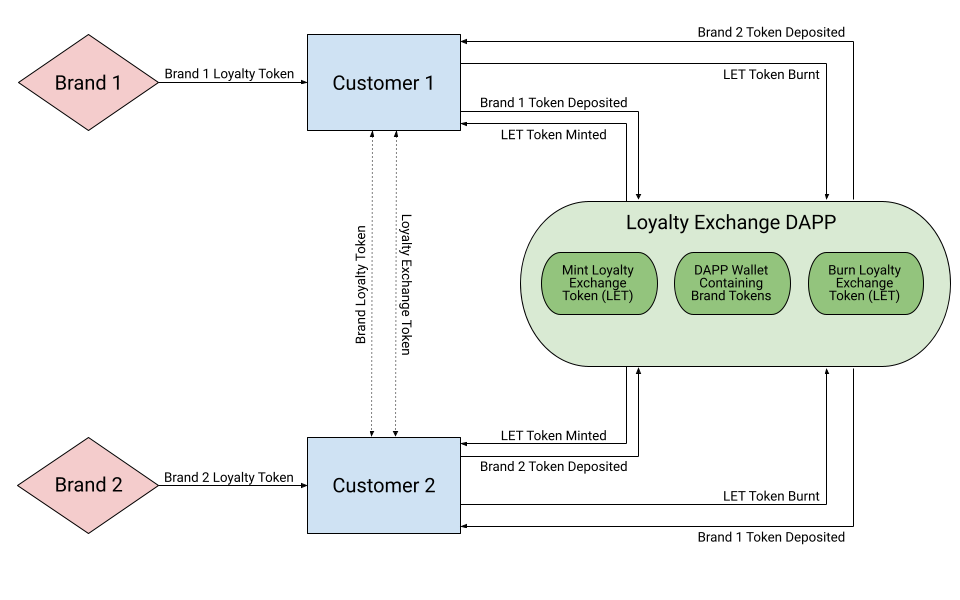

# Loyalty Points Token Exchange

### This Decentralized Application is an exchange where users can deposit their customer rewards points earned through purchases with specific brands (mock ERC20 Rewards Tokens for Delta, Starbucks, Nike, and BestBuy have been created for the development of this application), and receive our DAPP Loyalty Exchange Token (LET) in exchange. Users can then burn their LET token in order to withdraw any of the brand rewards tokens contained in the DAPP wallet. 
---

## Technologies

Using Python 3.7

* [streamlit](https://github.com/streamlit) - For web interface

Using Solidity 0.5.0 and 0.8.0 
* [Remix IDE](https://github.com/ethereum/remix-ide) - For Smart Contract Interface and Development
* [Open Zeppelin ERC20](https://github.com/OpenZeppelin/openzeppelin-contracts/blob/release-v2.5.0/contracts/token/ERC20/ERC20.sol) 
* [Open Zeppelin ERC20 Detailed](https://github.com/OpenZeppelin/openzeppelin-contracts/blob/release-v2.5.0/contracts/token/ERC20/ERC20Detailed.sol) 
* [Open Zeppelin IERC20](https://github.com/OpenZeppelin/openzeppelin-contracts/blob/master/contracts/token/ERC20/IERC20.sol) 
* [Open Zeppelin Address](https://github.com/OpenZeppelin/openzeppelin-contracts/blob/master/contracts/utils/Address.sol) 
* [Open Zeppelin SafeERC20](https://github.com/OpenZeppelin/openzeppelin-contracts/blob/master/contracts/token/ERC20/utils/SafeERC20.sol) - A new one for us!
---

## Installation Guide
To run the Loyalty Points Token Exchange files you must first have streamlit installed:

```python
  pip install streamlit
```

Clone the repository to your local machine:
```python
git clone <paste link here>
```

Upload the ```.sol``` files into [Remix IDE](https://github.com/ethereum/remix-ide)

---

## Usage

 

In order to use the smart contract part of this application:
1. Compile and deploy all of the brand tokens, specifying a total supply. The entire supply will be sent to the wallet address being used when the contract is deployed 
2. Compile and deploy the LoyaltyExchange.sol file, entering the contract address for the four brand tokens (Best Buy, Delta, Starbucks, and Nike) 
3. In order to deposit one of the brand tokens:
* You must be using a wallet that contains the brand tokens
* First you must use the approve function on the brand token contract, enter the Loyalty Exchange contract address and specify how many brand tokens you would like to send to the LoyaltyExchange contract
    * Additionally you may need to use the increase allowance function on the brand token contract, enter the LoyaltyExchange contract address and specify how many brand tokens you would like to send to the LoyaltyExchange contract
    * Next use the deposit function on the LoyaltyExchange contract (there is one for each brand token so be sure to use the appropriate function), specify how many tokens to deposit and click transact 
4. After depositing brand tokens, the same amount of Loyalty Exchange Tokens will be minted and sent to your wallet. You are free to send them to whoever you would like or burn them to withdraw a different brand token
5. In order to withdraw a brand token
  * You must have at least as many Loyalty Exchange Tokens as the amount of brand tokens you would like to withdraw 
  * The Loyalty Exchange contract balance for the specific brand token must have at least as many tokens as you would like to withdraw 
  * You can then specify the amount to withdraw using the correct withdraw function and click transact 
    * The selected amount of brand tokens will be sent to your address 
    * The selected amount of Loyalty Exchange Tokens will be burnt


<br/>

Streamlit Part of the Application: 
* When a customer makes a purchase at one of the (mock) affiliated corporations (Best Buy, Nike, Starbucks, and Delta). They record the transaction in the streamlit site using the Exchange_app.py. They are then rewarded with the respective reward points as tokens. Their wallet then stores the balance of all these tokens. Or they can exchange those tokens into our Loyalty Exchange tokens to be stored in the exchangeable and central token. From the site, their balances are stored and can be referenced. 

---

## Contributors
* Yuvraj Kabra
* Rebekah Lin
* Jeremy Griffith
* Cole Frederick
* Josh Thompkins

---

## License
We have no affiliation with the brands named in this project, tokens have been created solely to be used within this project for educational purposes only. 

Everyone is free to view and work with this project, you may not alter text unless given explicit permission.
